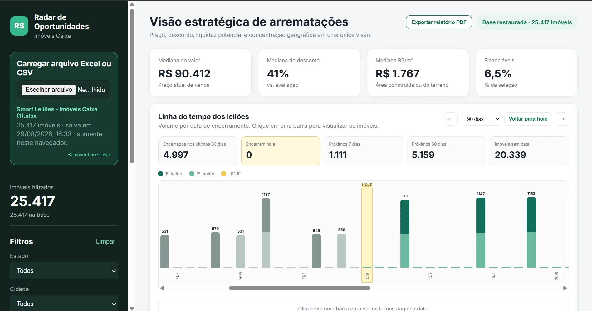

# Radar de Oportunidades — Imóveis Caixa

Dashboard web para explorar e comparar oportunidades de imóveis da Caixa a partir de uma planilha Excel ou CSV. Todo o processamento é realizado localmente no navegador: o arquivo não é enviado para um servidor.



## Funcionalidades

- Upload de arquivos `.xlsx`, `.xls` e `.csv`.
- Detecção automática da aba e da linha de cabeçalho.
- Indicadores de preço, desconto, R$/m², economia potencial e financiamento.
- Filtros por estado, cidade, múltiplos bairros, tipos de imóvel e modos de venda.
- Filtros por faixa de preço, desconto e área mínima.
- Gráficos de distribuição por valor, tipo e modalidade de venda.
- Comparação de imóveis financiáveis e não financiáveis por bairro.
- Ranking dos bairros com mais imóveis financiáveis.
- Ranking de oportunidades baseado em desconto, R$/m², financiamento e economia.
- Linha do tempo de primeiro e segundo leilão.
- Links diretos para os imóveis no site da Caixa.
- Exportação de relatório em PDF por meio da impressão do navegador.

## Como executar

O projeto não exige instalação ou etapa de compilação. Entretanto, é recomendado executá-lo por um servidor HTTP local, em vez de abrir o `index.html` diretamente por `file://`.

### Com o VS Code

1. Abra a pasta do projeto no VS Code.
2. Instale a extensão **Live Server**.
3. Clique com o botão direito em `index.html`.
4. Escolha **Open with Live Server**.

## Como utilizar

1. Abra o dashboard no navegador.
2. Clique em **Carregar arquivo Excel ou CSV**.
3. Selecione o arquivo de imóveis.
4. Aguarde a confirmação do processamento.
5. Utilize os filtros laterais para atualizar indicadores, gráficos e rankings.

Caso ainda não tenha a planilha, o dashboard apresenta um link para [Smart Leilões Caixa](https://smartleiloescaixa.com.br/home).

## Estrutura esperada da planilha

O sistema procura automaticamente o cabeçalho nas primeiras 15 linhas de cada aba e aceita algumas variações nos nomes das colunas.

As principais colunas reconhecidas são:

| Coluna | Uso |
|---|---|
| `ID` | Identificação do imóvel |
| `Estado` | Filtro por UF |
| `Cidade` | Filtro por cidade |
| `Bairro` | Filtro e análises geográficas |
| `Endereço` | Identificação e pesquisa do imóvel |
| `Tipo` | Casa, apartamento, loja, terreno etc. |
| `Modo Venda` | Modalidade de venda |
| `Preço Venda 1º Leilão` | Venda e evento do primeiro leilão |
| `Preço Venda 2º Leilão` | Venda e evento do segundo leilão |
| `Fim 1º Leilão` | Prazo final do primeiro leilão |
| `Fim 2º Leilão` | Prazo final do segundo leilão |
| `Preço Avaliação` | Avaliação e cálculo de desconto |
| `Desconto` | Desconto informado na base |
| `Área construída (m²)` | Área de casas, apartamentos e lojas |
| `Área terreno (m²)` | Área utilizada para terrenos |
| `Aceita Financiamento` | Segmentação de imóveis financiáveis |
| `Site` | Link do imóvel na Caixa |

As colunas de área também possuem fallback por posição:

- Coluna K: área construída.
- Coluna L: área do terreno.

## Cálculos

### Valor de venda

O preço utilizado considera a modalidade e os valores disponíveis de primeiro e segundo leilão.

### Área e R$/m²

- Casas, apartamentos e lojas utilizam a área construída.
- Terrenos utilizam a área do terreno.
- Quando a área principal não está disponível, o sistema tenta utilizar a alternativa.

### Desconto na linha do tempo

Cada etapa possui seu desconto calculado separadamente:

```text
(Avaliação - Venda) / Avaliação × 100
```

Percentuais negativos são destacados em vermelho.

### Score de oportunidade

O score é relativo à seleção atual e combina:

- desconto;
- R$/m²;
- economia absoluta;
- possibilidade de financiamento.

O score serve como apoio analítico e não representa recomendação financeira ou garantia de retorno.

## Linha do tempo

A linha do tempo transforma cada imóvel em até dois eventos:

- encerramento do primeiro leilão;
- encerramento do segundo leilão.

Ela oferece:

- períodos de 30 dias, 90 dias e 12 meses;
- destaque para **HOJE**;
- diferenciação entre datas passadas e futuras;
- volume separado por etapa;
- navegação entre períodos;
- listagem paginada com cinco eventos por página;
- acesso direto ao anúncio na Caixa.

Como a planilha não informa cancelamentos ou vendas concluídas, os estados da linha do tempo representam apenas a relação entre o prazo e a data atual:

- Encerrado;
- Encerra hoje;
- Próximo.

## Relatório PDF

Após carregar uma planilha, clique em **Exportar relatório PDF**.

O navegador abrirá a janela de impressão. Escolha **Salvar como PDF**.

O relatório utiliza formato A4 horizontal e inclui:

- nome do projeto;
- data e hora da extração;
- filtros utilizados;
- indicadores, gráficos, linha do tempo, rankings e insights;
- uma linha de cards por página.

O Explorador de imóveis não é incluído no PDF.

## Privacidade

A leitura e a análise do Excel acontecem no navegador. O projeto não possui backend e não envia o arquivo carregado para um servidor próprio.

As bibliotecas visuais são carregadas por CDN, portanto é necessário acesso à internet na primeira abertura.

## Dependências

- [SheetJS](https://sheetjs.com/) para leitura do Excel.
- [Chart.js](https://www.chartjs.org/) para os gráficos.
- [Inter](https://fonts.google.com/specimen/Inter) como fonte da interface.

As dependências são carregadas diretamente pelo `index.html`.

## Estrutura do projeto

```text
dashboard-leiloes/
├── index.html   # Estrutura da interface e estilos adicionais
├── style.css    # Estilos principais do dashboard
├── app.js       # Leitura, cálculos, filtros, gráficos e exportação
└── README.md    # Documentação do projeto
```

## Limitações conhecidas

- A qualidade da análise depende da consistência da planilha.
- Cabeçalhos muito diferentes dos aliases reconhecidos podem não ser detectados.
- Não existe informação sobre cancelamento, suspensão ou resultado efetivo do leilão.
- O relatório PDF pode variar ligeiramente conforme o navegador e as configurações de impressão.
- URLs ausentes ou inválidas não geram botão de acesso à Caixa.

## Tecnologias

O projeto utiliza HTML, CSS e JavaScript puro, sem framework e sem processo de build.
